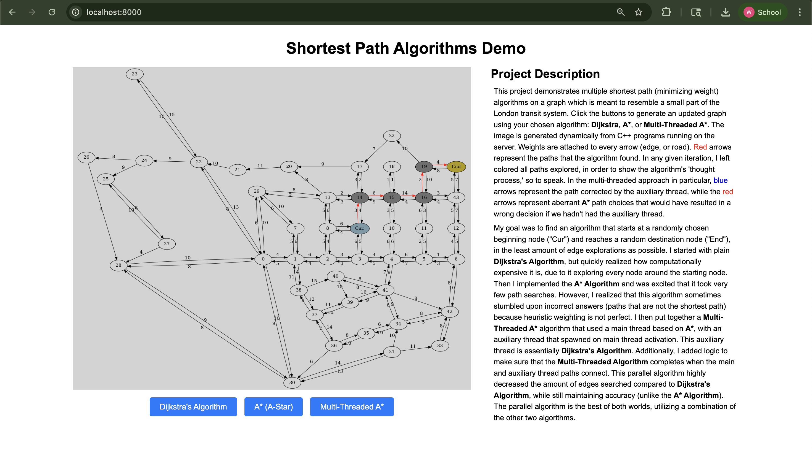

# Shortest Path Project

## Overview
This project implements multiple **shortest path algorithm** in C++ with support for efficient data structures and utilities provided by [Folly](https://github.com/facebook/folly).  
The goal is to explore high-performance implementations of graph routing algorithms in a road transit-like simulation. The map is a model of a small part of the London transit system.

## Web Interface

The project includes an interactive web interface that demonstrates the algorithm in real-time, generating dynamic vizualizations of the pathfinding process.



## Features
- Reads data from an easy-to-use json format with Folly.
- Implements shortest path algorithms (e.g., Dijkstra, A*, Parallel-Bidirectional A*).  
- The bidirectional A* algorithm uses **std::thread** to parallelize the normal A* algorithm to achieve better results than the single-threaded normal version.
- **Interactive web interface for real-time algorithm visualization.
- Supports directed weighted graphs.
- Includes test cases and benchmarks.
- Includes a C-style array-based **Matrix** class.

## Requirements
- C++20 or later  
- [Folly](https://github.com/facebook/folly)  
- CMake (for build system)  
- Docker (optional, for web interface)

## Installation

### Option 1: Docker (Recommended for Web Interface)
```bash
# Clone the repository
git clone https://github.com/William-Thomas-Andrews/Shortest_Path_Algorithms.git
cd Shortest_Path_Algorithms

# Build
docker build -t shortest-path-app .
docker run -p 8000:8000 shortest-path-app

# Visit http://localhost:8000 in your browser
```

### Option 2: Native Build
```bash
# Clone the repository
git clone https://github.com/William-Thomas-Andrews/Shortest_Path_Algorithms.git
cd Shortest_Path_Algorithms

# Build
cd scripts/
./configure.sh
./build.sh
./run.sh
```


## Usage
- **Web Interface**: After running the Docker container, navigate to http://localhost:8000 to access the interactive demonstration.
- **Command Line**: Use the native build option for direct C++ execution and benchmarking.